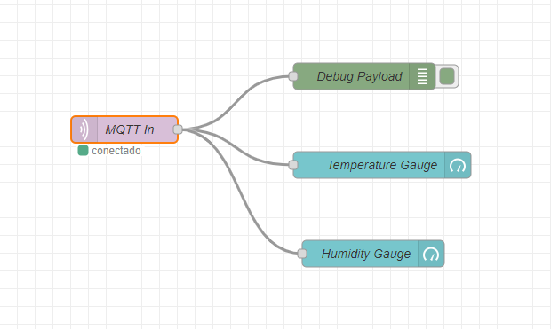
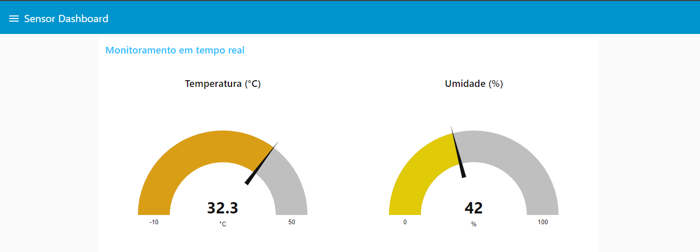
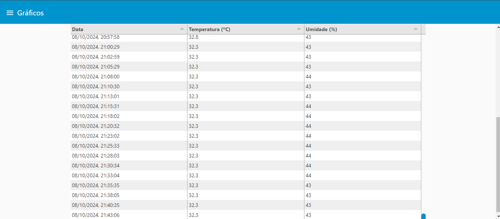
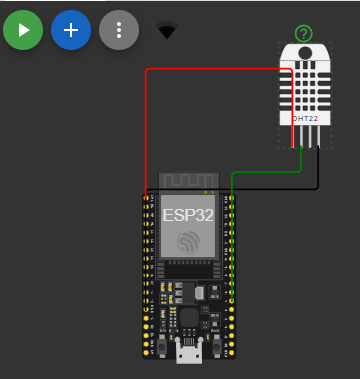
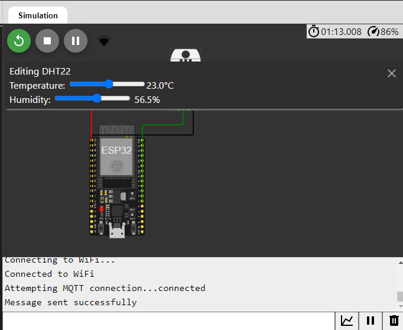
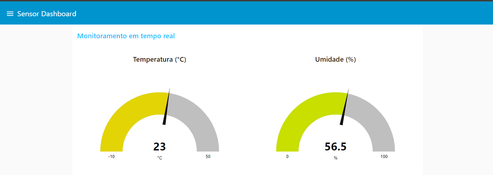

# IoT - Sistema de Controle de Temperatura e Umidade Residencial

Desenvolvido por [Leonardo Donato](https://github.com/leopdonato) - leonardo.donato@aluno.ifsp.edu.br / [Rodrigo Betussi](https://github.com/betussi) - rodrigo.betussi@aluno.ifsp.edu.br

## Projeto de Trabalho de Conclusão da Disciplina de Plataformas de Prototipação para IoT (E2PPT) - IFSP CTD

### Visão Geral

Este projeto visa monitorar em tempo real a temperatura e umidade através do sensor DHT11, onde os dados são enviados para um banco de dados (DynamoDB) e é possível através de um gráfico ter um histórico completo das coletas para futuras análises. 
O sistema é composto por três conjuntos principais:

1. **Publicação de Dados via MQTT**:  
   Através do ESP32 os dados são coletados e enviados via protocolo MQTT.

2. **Controle de Temperatura e Umidade**:  
   Os dados são coletados via Node-Red e armazenados no banco de dados DynamoDB.

3. **Visualização dos Dados**:  
   Utilizando o Node-Red os dados coletados pelo sensor DHT11 podem ser visualizados em tempo real.

   Código ESP32 - https://github.com/betussi/esp32-iot/blob/main/DTH11_Sensor_MQTT_Chaves.ino

### Componentes e Infraestrutura Utilizada
- Sensor DHT11
- ESP32
- Protocolo de comunicação MQTT
- Node-Red (Back-end e Front-End) hospedado na AWS
- Banco de Dados - AWS DynamoDB

### Node-Red - Flow
http://ec2-52-14-56-16.us-east-2.compute.amazonaws.com:1880/#flow/9836ac50350623ca

### Node-Red - UI
http://ec2-52-14-56-16.us-east-2.compute.amazonaws.com:1880/ui

## Monitoramento em tempo real

## Gráfico com os dados coletados e armazenados no banco de dados DynamoDB

## Tabela com os dados coletados e armazenados no banco de dados DynamoDB

### Simulação Wokwi

Os circuitos estão simulados na plataforma Wokwi e podem ser acessado através do link abaixo:
https://wokwi.com/projects/305569599398609473

## Simulação da montagem do projeto

## Simulação do projeto em execução

## Resultado a coleta feita via Wokwi

